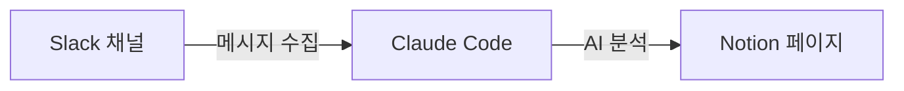

# claude-slack-to-notion

Slack 메시지를 AI로 분석하여 Notion 페이지로 정리하는 Claude Code 플러그인

## 이게 뭔가요?

Slack 채널의 대화를 자동으로 수집하고, 원하는 방향으로 분석하여 Notion 페이지로 만들어줍니다.
회의록 정리, 이슈 추출, 주제별 분류 등 분석 방향은 자유롭게 지정할 수 있습니다.



## 설치

### 요구사항

- [Claude Code CLI](https://docs.anthropic.com/en/docs/claude-code)
- [uv](https://docs.astral.sh/uv/) (macOS: `brew install uv`)

### 한 줄 설치

아래 명령어를 터미널에 붙여넣으세요. 안내에 따라 토큰을 입력하면 자동으로 설치됩니다:

```bash
curl -sL https://raw.githubusercontent.com/dykim-base-project/claude-slack-to-notion/main/scripts/setup.sh | bash
```

> 토큰 발급이 처음이라면 [설치 및 토큰 설정 가이드](docs/setup-guide.md)를 참고하세요.

## 사용법

Claude Code에서 자연어로 말하면 됩니다. 아래 예시를 그대로 복사해서 사용하세요:

```
Slack 채널 목록 보여줘
```

```
#general 채널의 최근 메시지를 Notion에 회의록으로 정리해줘
```

```
#backend 채널에서 이번 주 논의된 버그 이슈만 추려서 정리해줘
```

```
이 스레드 내용을 주제별로 분류해서 Notion 페이지로 만들어줘
```

> 분석 방향은 자유롭게 지정할 수 있습니다. "요약해줘", "액션 아이템만 뽑아줘", "결정사항 위주로 정리해줘" 등 원하는 대로 요청하세요.

## 문제가 생겼나요?

[문제 해결 가이드](docs/troubleshooting.md)를 확인하세요.

## 더 알아보기

- [설치 및 토큰 설정 가이드](docs/setup-guide.md) — 토큰 발급, 업데이트, 수동 설치
- [제공 도구 목록](docs/tools.md) — 플러그인이 제공하는 12개 MCP 도구
- [개발자 가이드](docs/development.md) — 프로젝트 구조, 기술 스택, CI/CD, 기여 방법
- [개발 과정](docs/decisions.md) — 주요 의사결정 히스토리

## 라이선스

MIT
