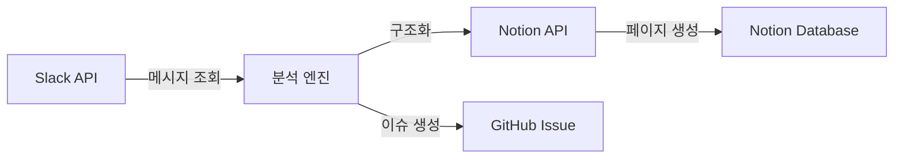

# claude-slack-to-notion

Slack 메시지/스레드를 분석하여 Notion으로 정리하고 이슈를 생성하는 자동화 Claude Code 플러그인

> 이 프로젝트는 현재 설계 단계입니다. 아래 기능은 구현 목표이며, 아직 동작하지 않습니다.

## 개요

`claude-slack-to-notion`은 Slack 채널의 대화 내용을 수집·분석하여 Notion 페이지로 자동 정리하고, 필요시 GitHub 이슈를 생성하는 도구입니다.
Claude Code CLI 환경에서 AI 기반 워크플로우 스킬을 활용하여 Slack 데이터를 구조화된 문서로 변환합니다.

## 목표 기능

- **Slack 채널 메시지/스레드 수집**: Slack API를 통해 채널 메시지 및 스레드 댓글 조회
- **메시지 분석 및 구조화**: AI 기반 내용 분석, 토픽 분류, 요약 생성
- **Notion 페이지/데이터베이스 자동 생성**: 분석 결과를 Notion 페이지로 자동 작성
- **이슈 자동 업**: Notion 정리 내용을 기반으로 GitHub 이슈 자동 생성 (`/github-issue` 스킬 연동)

## 요구사항

- [Claude Code CLI](https://docs.anthropic.com/en/docs/claude-code) 설치
- GitHub CLI (`gh`) 설치
- Slack API 토큰 (Bot Token, User Token)
- Notion API 키 (Integration Token)

## 설치

### devex 플러그인 기반 설치

```bash
# 신규 설치
curl -sL https://raw.githubusercontent.com/dykim-base-project/claude-devex/main/setup.sh | bash

# 버전 확인
curl -sL https://raw.githubusercontent.com/dykim-base-project/claude-devex/main/setup.sh | bash -s -- --check

# 업데이트
curl -sL https://raw.githubusercontent.com/dykim-base-project/claude-devex/main/setup.sh | bash -s -- --update
```

설치 후 `.claude/` 디렉토리와 워크플로우 스킬이 자동으로 구성됩니다.

## 설정

### 환경변수 또는 설정 파일

API 토큰과 키는 환경변수 또는 `.claude/settings.local.json`에 저장합니다. (Git 추적 금지)

| 파일 | 범위 | Git 추적 | 용도 |
|------|------|:--------:|------|
| `.claude/settings.json` | 공통 설정 | O | 프로젝트 공통 권한, 기본값 |
| `.claude/settings.local.json` | 로컬 전용 | X | API 토큰, 개인 설정 |
| `.claude/project-profile.md` | 프로젝트 프로필 | O | 스킬 동작 조정용 프로필 |

### API 토큰 설정

API 토큰 관리 방식은 구현 시 결정 예정입니다. 환경변수 방식을 우선 검토합니다.

```bash
export SLACK_BOT_TOKEN="xoxb-..."
export SLACK_USER_TOKEN="xoxp-..."
export NOTION_API_KEY="secret_..."
```

## 사용 방법

### 워크플로우 스킬

| 스킬 | 명령어 | 설명 |
|------|--------|------|
| 이슈 생성 | `/github-issue` | GitHub 이슈 생성, 라벨 매핑, 브랜치명 제안 |
| 명세 작성 | `/spec` | 요구사항 분석, 아키텍처 설계, 다이어그램 생성 |
| 구현 | `/implement` | 설계 문서 기반 코드 구현 |
| 커밋 | `/commit` | diff 리뷰, 커밋 메시지 제안 및 커밋 |
| PR 생성 | `/github-pr` | PR 생성, 이슈 연결 |
| 전체 사이클 | `/cycle` | 이슈 → 플랜 → 구현 → 리뷰 → PR → 검증 → 완료 |

## 목표 데이터 흐름



1. Slack API를 통해 채널 메시지 및 스레드 수집
2. AI 기반 분석으로 토픽 분류, 요약 생성
3. Notion API로 페이지/데이터베이스 자동 작성
4. 필요시 GitHub 이슈 자동 생성

## 프로젝트 구조

```
claude-slack-to-notion/
├── CLAUDE.md                        # AI 협업 가이드 (프로젝트 규칙)
├── README.md                        # 이 파일
├── .gitignore
└── .claude/
    ├── README.md                    # 워크플로우 가이드
    ├── settings.json                # 공통 설정 [Git 추적]
    ├── settings.local.json          # 로컬 설정 [Git 무시]
    ├── project-profile.md           # 프로젝트 프로필 [Git 추적]
    ├── .devex-version               # devex 버전 관리
    ├── .gh-token                    # GitHub CLI 토큰 [Git 무시]
    └── skills/                      # 워크플로우 스킬
        ├── github-issue/SKILL.md    # /github-issue
        ├── spec/SKILL.md            # /spec
        ├── implement/SKILL.md       # /implement
        ├── commit/SKILL.md          # /commit
        ├── github-pr/SKILL.md       # /github-pr
        └── cycle/SKILL.md           # /cycle
```

## 개발 가이드

Git Flow, 브랜치 전략, 커밋 컨벤션, 개발 사이클 등 개발 프로세스는 [CLAUDE.md](./CLAUDE.md)를 참고하세요.

## 제약사항

- **API 토큰 관리**: Slack API 토큰, Notion API 키는 환경변수 또는 `.claude/settings.local.json`로 관리 (Git 추적 금지)
- **개인 메시지(DM) 제외**: 보안상 개인 DM 수집 지원하지 않음
- **API Rate Limit**: Slack/Notion API Rate Limit 고려 필요 (과도한 요청 시 제한 발생 가능)
- **Bot 권한**: Slack Bot이 조회할 채널에 미리 초대되어 있어야 함

## 라이선스

미정

## 기여

이슈 및 PR은 [GitHub 레포지토리](https://github.com/dykim-base-project/claude-slack-to-notion)에서 관리합니다.
