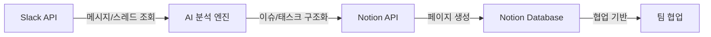

# claude-slack-to-notion

Slack 메시지/스레드를 분석하여 Notion 페이지로 정리하는 Claude Code 플러그인

## 개요

`claude-slack-to-notion`은 Slack 채널의 대화 내용을 수집·분석하여 이슈/태스크로 구조화하고, Notion 페이지로 자동 정리하는 도구입니다.
정리된 Notion 페이지를 기반으로 팀 협업을 진행하는 워크플로우를 제공합니다.

### 주요 기능

- **Slack 채널 메시지/스레드 수집**: Slack API를 통해 채널 메시지 및 스레드 댓글 조회
- **메시지 분석 및 구조화**: AI 기반 내용 분석, 토픽 분류, 이슈/태스크 도출
- **Notion 페이지 자동 생성**: 분석된 이슈/태스크를 Notion 페이지로 작성하여 협업 기반 제공

## 요구사항

- [Claude Code CLI](https://docs.anthropic.com/en/docs/claude-code)
- Python 3.10 이상 (macOS: `brew install python3`)
- Slack Bot Token
- Notion API Key
- Notion Parent Page ID

## 설치

```bash
# 로컬 클론 후 설치
git clone https://github.com/dykim-base-project/claude-slack-to-notion.git
claude --plugin-dir ./claude-slack-to-notion
```

> 최초 실행 시 Python 환경(venv)이 자동으로 설정됩니다.
> 현재 **macOS/Linux**만 지원합니다.

## 설정

### API 토큰 설정

API 토큰은 환경변수로 설정합니다.

```bash
export SLACK_BOT_TOKEN="xoxb-..."
export NOTION_API_KEY="secret_..."
export NOTION_PARENT_PAGE_ID="..."
```

#### Slack Bot Token 발급

1. [Slack API](https://api.slack.com/apps) 접속
2. "Create New App" → "From scratch" 선택
3. App 이름 및 Workspace 선택
4. "OAuth & Permissions" → "Bot Token Scopes" 추가:
   - `channels:history` (공개 채널 메시지 읽기)
   - `channels:read` (채널 목록 조회)
   - `users:read` (사용자 정보 조회)
5. "Install to Workspace" 클릭
6. 발급된 "Bot User OAuth Token" 복사 (xoxb-로 시작)

#### Notion API Key 발급

1. [Notion Integrations](https://www.notion.so/my-integrations) 접속
2. "New integration" 클릭
3. Integration 이름 입력, Workspace 선택
4. "Submit" 후 발급된 "Internal Integration Token" 복사 (secret_로 시작)
5. Notion에서 정리할 페이지로 이동
6. 우측 상단 "..." → "Add connections" → 생성한 Integration 연결

#### Notion Parent Page ID 확인

1. Notion에서 정리할 상위 페이지 열기
2. 브라우저 주소창 URL 확인: `https://www.notion.so/workspace/{PAGE_ID}?v=...`
3. `{PAGE_ID}` 부분 복사 (32자 문자열)

## 사용 방법

Claude Code에서 자연어로 사용할 수 있습니다.

### 사용 예시

```
Slack #general 채널 메시지 조회해줘
```

```
#design 채널의 최근 50개 메시지를 Notion에 정리해줘
```

```
이 스레드 내용 요약해서 Notion 페이지로 만들어줘
```

## 제공 도구

| 도구 | 설명 |
|------|------|
| `list_channels` | Slack 채널 목록 조회 |
| `fetch_messages` | 특정 채널의 메시지 조회 |
| `fetch_thread` | 특정 스레드의 전체 메시지 조회 |
| `fetch_channel_info` | 채널 상세 정보 조회 |

## 데이터 흐름



1. Slack API를 통해 채널 메시지 및 스레드 수집
2. AI 기반 분석으로 토픽 분류, 이슈/태스크 도출
3. Notion API로 구조화된 페이지 자동 작성
4. 정리된 Notion 페이지를 기반으로 팀 협업 진행

## 프로젝트 구조

```
claude-slack-to-notion/
├── .claude-plugin/
│   └── plugin.json                  # 플러그인 매니페스트
├── .mcp.json                        # MCP 서버 설정
├── scripts/
│   └── run-server.sh                # 자동 환경 설정 스크립트
├── src/
│   └── slack_to_notion/
│       ├── mcp_server.py            # MCP 서버 (도구 제공)
│       ├── slack_client.py          # Slack API 연동
│       ├── analyzer.py              # AI 분석 엔진
│       ├── notion_client.py         # Notion API 연동
│       └── config.py                # 설정 관리
├── pyproject.toml                   # Python 패키지 설정
├── README.md                        # 이 파일
└── .gitignore
```

## 제약사항

- **플랫폼**: macOS/Linux만 지원 (Windows 지원 예정)
- **API 토큰 관리**: Slack API 토큰, Notion API 키는 환경변수로 관리 (Git 추적 금지)
- **개인 메시지(DM) 제외**: 보안상 개인 DM 수집 지원하지 않음
- **API Rate Limit**: Slack/Notion API Rate Limit 고려 필요 (과도한 요청 시 제한 발생 가능)
- **Bot 권한**: Slack Bot이 조회할 채널에 미리 초대되어 있어야 함

## 라이선스

미정

## 기여

이슈 및 PR은 [GitHub 레포지토리](https://github.com/dykim-base-project/claude-slack-to-notion)에서 관리합니다.

---

**개발 가이드**: Git Flow, 브랜치 전략, 커밋 컨벤션 등 개발 프로세스는 [CLAUDE.md](./CLAUDE.md)를 참고하세요.
